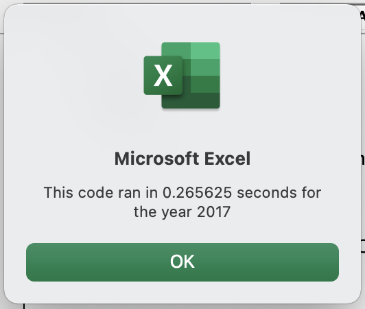
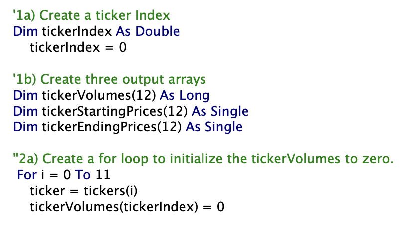

##Overview of Project 

   Steve, my client, would like to analyze an entire dataset of stocks to recommend to his parents. He would like to give them a diverse portfolio that has proven success and stock that been having gains.  
   To do this, I will run code using Microsoft Visual Basics in Excel.  I will analysis stocks for 12 companies over two years and refactor the code to create a code that runs fast and is easy to execute.  

##Results

   I created a spreadsheet with stock information from 12 companies.  I found the total daily volume and yearly return for each stock.  The daily volume measures how active the stock is traded; and the yearly return is a percentage of the difference in price from the beginning of the year to the end of the year.  Using VBA, the worksheet has a user defined input when the script is executed.  The output is color coded and clearly gives the successful stocks in green while the stocks that lost ground in red.  My first attempt executing this analysis for the 2017 and 2018 year yielded the following results, respectively:
   

   Even though the run times for each of the analysis is slightly less than half a second, I refactored the code.  This attempt of the refactored code for same years yielded the following result:
	

   As presented in the above image, the refactored code run in slightly over a quarter of a second.  This is thirty hundredths of a second faster than the unfactored code.  This was accomplished by creating an index for the array and setting it to zero.  Then, the iterator could run through each of the 12 indexes only once.  
   The critical part of the code is presented below:

##Summary 

   After completing the analysis and refactoring the code, I found that it was advantageous to refactor the code.  It allowed me to take a close examination of the data and check for patterns or duplications that could be written more simply and take up less data.  Conversely, it took more time to comb through the data and find patterns, figure a solution to prevent redundancies, and implement the new code.  I feel that the pros and cons of the refactored code reached a point of diminishing return in saving time and implementing an efficient code that eliminated redundancies.  Basically, we are saving hundredths of a second on a file that will be looked at and thought about before a decision is made.  In other words, this worksheet is neither time critical nor requires a high degree of timeliness.  
